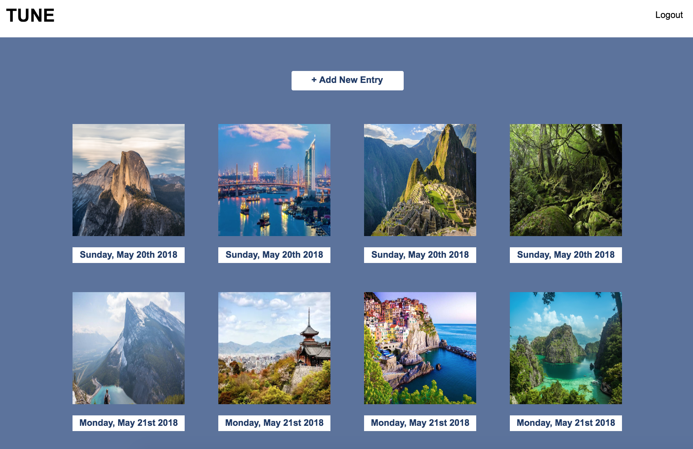
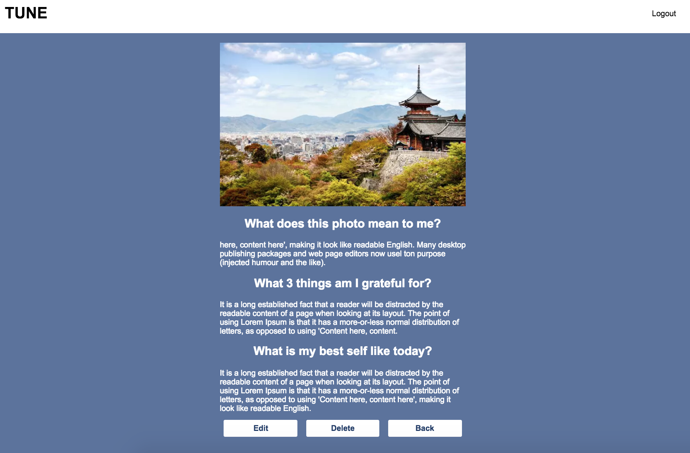
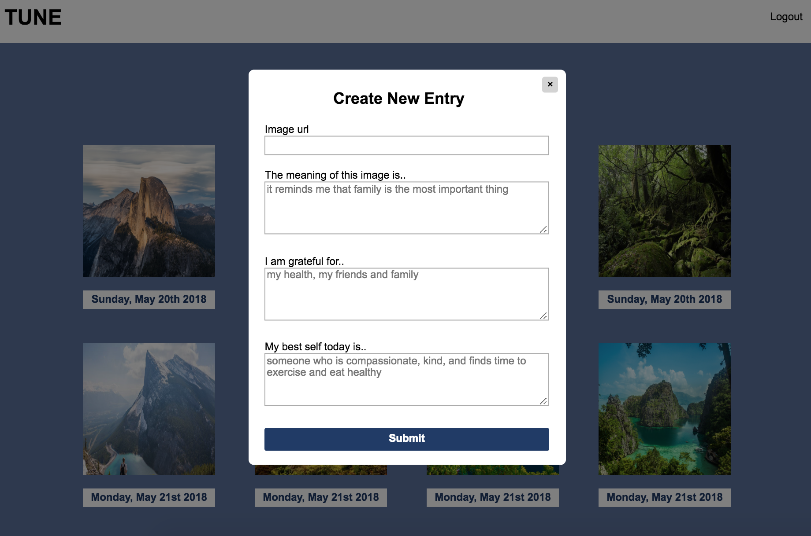

# Tune 
Tune is a simply structured daily journal based on the science of positive psychology, that helps you focus your attention on meaning, gratitude, and your best possible self so you can  build a happier and healthier mind. 

# Demo

For a demo account use the following credentials: 
Username:  demousername
Password:  demopassword 

# Screenshots
Landing Page

Dashboard

Entry View

Create Entry 

# Technology 
<ul>
    <li>HTML5, CSS3, Javascript, jQuery</li>
    <li>Node.js + Express.js</li>
    <li>MongoDB</li>
    <li>Mongoose </li>
    <li>Mocha + Chai </li>
    <li>Travis CI</li>
    <li>JWT Authentication</li>
    <li>Bcrypt</li>
    <li>Passport</li>
</ul>
